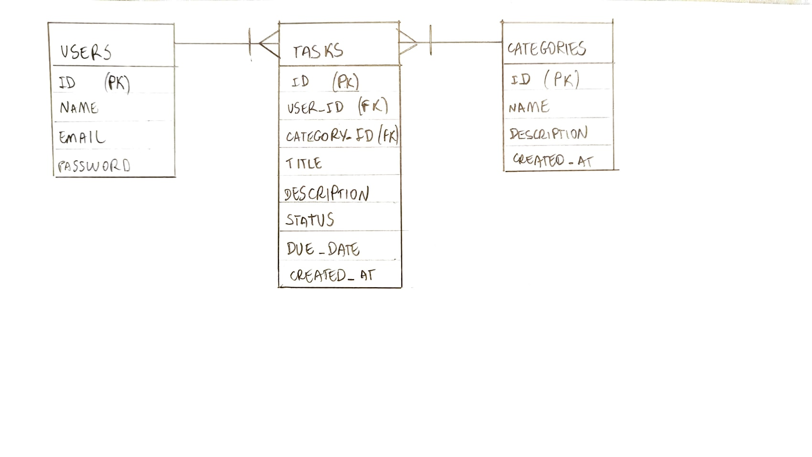
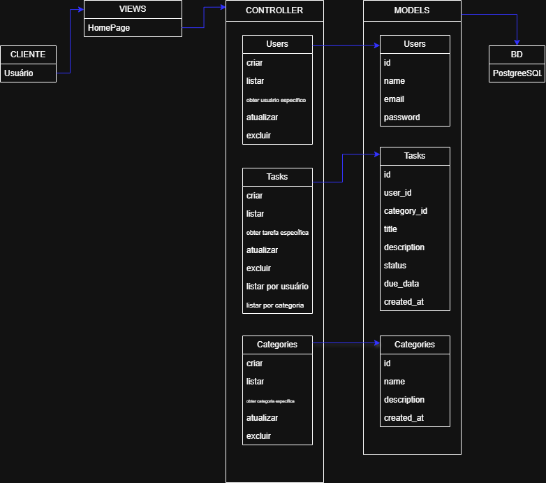

# Web Application Document - Projeto Individual - Módulo 2 - Inteli

## Taskly

#### Isabel Montenegro

## Sumário

1. [Introdução](#c1)  
<br>

2. [Visão Geral da Aplicação Web](#c2)  

<details>
  <summary>Subtópicos</summary>

  - [2.1. Personas](#c2.1)
  - [2.2. User Stories](#c2.2)

</details>
<br>

3. [Projeto Técnico da Aplicação Web](#c3)  

<details>
  <summary>Subtópicos</summary>

- [3.1. Modelagem do banco de dados](#c3.1)
  - [3.1.1. BD e Models](#c3.1.1)
- [3.2. Arquitetura](#c3.2)
- [3.3. Wireframes](#c3.3)
- [3.4. Guia de estilos](#c3.4)
- [3.5. Protótipo de alta fidelidade](#c3.5)
- [3.6. Wireframes](#c3.6)
- [3.7. Interface e Navegação](#c3.7)

</details>
<br>

4. [Desenvolvimento da Aplicação Web](#c4)  

<details>
  <summary>Subtópicos</summary>

- [4.1. Demonstração do Sistema Web](#c4.1)
- [4.2. Conclusões e Trabalhos Futuros](#c4.2)

</details>
<br>

5. [Referências](#c5)  


## <a name="c1"></a>1. Introdução 

O **Taskly** é um sistema desenvolvido para auxiliar na organização pessoal e profissional, permitindo que os usuários criem, editem, excluam e acompanhem tarefas com diferentes níveis de prioridade. O sistema é projetado para ser leve, intuitivo e expansível, com foco na produtividade e organização eficiente. Ele oferece funcionalidades básicas como cadastro de usuários, gerenciamento de tarefas, controle de status e prioridades. Futuras melhorias podem incluir notificações e integração com outras ferramentas de produtividade.


## <a name="c2"></a>2. Visão Geral da Aplicação Web

### 2.1. Personas 

*Posicione aqui sua(s) Persona(s) em forma de texto markdown com imagens, ou como imagem de template preenchido. Atualize esta seção ao longo do módulo se necessário.*

### 2.2. User Stories 

*Posicione aqui a lista de User Stories levantadas para o projeto. Siga o template de User Stories e utilize a referência USXX para numeração (US01, US02, US03, ...). Indique todas as User Stories mapeadas, mesmo aquelas que não forem implementadas ao longo do projeto. Não se esqueça de explicar o INVEST de 1 User Storie prioritária.*


## <a name="c3"></a>3. Projeto da Aplicação Web

### 3.1. Modelagem do banco de dados  

O banco de dados foi projetado para armazenar as informações de **usuários**, **tarefas** e **categorias**, com relacionamentos bem definidos para garantir a integridade dos dados. O modelo inclui três tabelas principais:

* **Users**: Armazena informações dos usuários, como nome, email e senha.
* **Tasks**: Registra as tarefas criadas, com detalhes como título, descrição e data de entrega.
* **Categories**: Define as categorias que podem ser associadas às tarefas, facilitando a organização.

O modelo relacional é ilustrado no diagrama abaixo:

<div align="center">
<sub>Figura 01 - Modelo físico</sub>

<sup>Fonte: Material produzido pela autora (2025)</sup>
</div>
<br>

Além do diagrama, o modelo físico do banco de dados é definido no arquivo `init.sql`, que contém as instruções para criação e estruturação das tabelas:


```sql
CREATE TABLE Categories (
id INT AUTO\_INCREMENT PRIMARY KEY,
name VARCHAR(100) NOT NULL,
description TEXT,
created\_at TIMESTAMP DEFAULT CURRENT\_TIMESTAMP
);

-- Cria o banco de dados, se não existir
CREATE DATABASE IF NOT EXISTS gerenciador_tarefas;

-- Usa o banco de dados criado
USE gerenciador_tarefas;

-- Cria a tabela de usuários
CREATE TABLE Users (
    id INT AUTO_INCREMENT PRIMARY KEY,
    name VARCHAR(100) NOT NULL,
    email VARCHAR(100) NOT NULL UNIQUE,
    password VARCHAR(255) NOT NULL,
    created_at TIMESTAMP DEFAULT CURRENT_TIMESTAMP
);

-- Cria a tabela de tarefas
CREATE TABLE Tasks (
    id INT AUTO_INCREMENT PRIMARY KEY,
    user_id INT NOT NULL,
    category_id INT,
    title VARCHAR(255) NOT NULL,
    description TEXT,
    status ENUM('pendente', 'concluída', 'em progresso') DEFAULT 'pendente',
    due_date DATE,
    created_at TIMESTAMP DEFAULT CURRENT_TIMESTAMP,
    FOREIGN KEY (user_id) REFERENCES Users(id),
    FOREIGN KEY (category_id) REFERENCES Categories(id)
);
```


### 3.1.1 BD e Models 

O sistema Taskly utiliza um banco de dados PostgreSQL estruturado para representar a lógica de tarefas, usuários e categorias. Os models são definidos diretamente nos controladores com consultas SQL utilizando a biblioteca pg, mas seguem claramente a arquitetura MVC e representam as entidades do domínio da aplicação. Isso pode ser visualizado na imagem abaixo:

<div align="center">
<sub>Figura 02 - Arquitetura MVC</sub>

<sup>Fonte: Material produzido pela autora (2025)</sup>
</div>
<br>

**🔸 Model: Users**
Responsável por armazenar os dados dos usuários do sistema.

Campos:
- *id:* identificador único (chave primária)
- *name:* nome do usuário
- *email:* email do usuário (único)
- *password:* senha criptografada (em produção)
- *created_at:* data de criação

**🔸 Model: Categories**
Representa as categorias de tarefas.

Campos:

- *id:* identificador da categoria
- *name:* nome da categoria
- *description:* descrição opcional
- *created_at:* data de criação

**🔸 Model: Tasks**
Model principal da aplicação, responsável por armazenar as tarefas cadastradas pelos usuários.

Campos:

- *id:* identificador da tarefa
- *user_id:* referência ao usuário (chave estrangeira)
- *category_id:* referência à categoria (chave estrangeira)
- *title:* título da tarefa
- *description:* descrição detalhada
- *status:* estado atual da tarefa (pendente, concluída, em progresso) usando tipo ENUM
- *due_date:* data limite para conclusão
- *created_at:* data de criação da tarefa

Todos os relacionamentos são definidos com chaves estrangeiras, e o status das tarefas é controlado por um tipo ENUM chamado task_status, garantindo integridade e padronização.

### 3.2. Arquitetura

Esta seção descreve a arquitetura MVC do projeto Taskly, detalhando o fluxo de dados e as responsabilidades de cada componente – do cliente ao banco de dados e vice-versa – para o gerenciamento de tarefas.

**1. Cliente/Postman:** O cliente (seja um navegador ou o Postman durante o desenvolvimento) inicia o processo enviando uma requisição HTTP. Essa requisição pode ser para criar uma nova tarefa (POST), obter uma lista de tarefas (GET), atualizar uma tarefa existente (PUT) ou deletar uma tarefa (DELETE).

**2. Rotas Express:** As rotas Express recebem a requisição e a direcionam para o Controller apropriado. Por exemplo, uma requisição para /api/tasks pode ser roteada para o TaskController.

**3. Controller (TaskController):** O Controller recebe a requisição das rotas. Ele processa a lógica de negócio necessária:

- Se for uma requisição para obter dados (GET), o Controller solicita os dados do Model.
- Se for uma requisição para criar, atualizar ou deletar dados (POST, PUT, DELETE), o Controller interage com o Model para realizar essas operações no banco de dados.

**4. Model (implícito no TaskController):** No seu projeto Taskly, a lógica do Model está implementada diretamente no TaskController.js. O Controller usa pool.query() para interagir com o banco de dados PostgreSQL, realizando as operações CRUD (Create, Read, Update, Delete) nas tabelas (por exemplo, tasks, users).

**5. Banco de Dados PostgreSQL:** O banco de dados armazena os dados do seu projeto. O Model (através do Controller) envia consultas SQL para o banco de dados e recebe os resultados (dados solicitados ou confirmação das operações).

**6. Controller (retorno):** O Controller recebe os dados do banco de dados (através do Model). Ele pode formatar esses dados, se necessário.

**7. Rotas Express (retorno):** As rotas Express recebem os dados do Controller e os enviam de volta ao cliente em um formato adequado (geralmente JSON).

**8. Cliente/Postman (recebimento):** O cliente recebe a resposta e a exibe ao usuário (no caso de uma interface web) ou a utiliza para testes (no caso do Postman).

Em resumo, o fluxo é: Cliente -> Rotas -> Controller -> Model (banco de dados) -> Controller -> Rotas -> Cliente. O Controller atua como intermediário, coordenando a interação entre a View (representada pelo Cliente) e o Model (a lógica de acesso aos dados, que no seu caso está dentro do Controller).

### 3.3. Wireframes (Semana 03 - opcional)

*Posicione aqui as imagens do wireframe construído para sua solução e, opcionalmente, o link para acesso (mantenha o link sempre público para visualização).*

### 3.4. Guia de estilos (Semana 05 - opcional)

*Descreva aqui orientações gerais para o leitor sobre como utilizar os componentes do guia de estilos de sua solução.*


### 3.5. Protótipo de alta fidelidade (Semana 05 - opcional)

*Posicione aqui algumas imagens demonstrativas de seu protótipo de alta fidelidade e o link para acesso ao protótipo completo (mantenha o link sempre público para visualização).*

### 3.6. WebAPI e endpoints 

Esta seção apresenta a documentação da Web API desenvolvida para o sistema Taskly. A API segue o padrão REST e permite a interação com os dados de tarefas, usuários e categorias por meio de requisições HTTP. Abaixo estão listados os principais endpoints, seus métodos, estruturas esperadas e possíveis respostas.

Base URL:
```sql
http://localhost:8080/api
```

**🔸 1. Criar Tarefa**

- Método: POST
- Endpoint: /tasks
- Descrição: Cria uma nova tarefa vinculada a um usuário e uma categoria.
- Body (JSON):

```sql
{
  "user_id": 1,
  "category_id": 1,
  "title": "Estudar lógica de programação",
  "description": "Revisar operadores lógicos",
  "status": "pendente",
  "due_date": "2025-06-01"
}
```

- Respostas:

  - 201 Created: tarefa criada com sucesso
  - 500 Internal Server Error: erro ao inserir tarefa

**🔸 2. Listar Todas as Tarefas**

- Método: GET
- Endpoint: /tasks
- Descrição: Retorna uma lista de todas as tarefas, incluindo nome do usuário e categoria.

**🔸 3. Buscar Tarefa por ID**

- Método: GET
- Endpoint: /tasks/:id
- Descrição: Retorna uma tarefa específica pelo seu id.

**🔸 4. Atualizar Tarefa**

- Método: PUT
- Endpoint: /tasks/:id
- Descrição: Atualiza os dados de uma tarefa.
- Body (JSON):

```sql
{
  "user_id": 1,
  "category_id": 1,
  "title": "Estudar JavaScript",
  "description": "Curso completo de JS",
  "status": "em progresso",
  "due_date": "2025-06-02"
}
```

- Respostas:

  - 200 OK: tarefa atualizada
  - 404 Not Found: tarefa não encontrada

**🔸 5. Excluir Tarefa**

- Método: DELETE
- Endpoint: /tasks/:id
- Descrição: Remove uma tarefa do sistema.

- Resposta:

  - 200 OK: tarefa excluída com sucesso
  - 404 Not Found: tarefa não encontrada

**🔸 6. Listar Tarefas por Usuário**

- Método: GET
- Endpoint: /users/:user_id/tasks
- Descrição: Retorna todas as tarefas vinculadas a um determinado usuário.

**🔸 7. Listar Tarefas por Categoria**

- Método: GET
- Endpoint: /categories/:category_id/tasks
- Descrição: Retorna todas as tarefas de uma categoria específica.

### 3.7 Interface e Navegação (Semana 07)

*Descreva e ilustre aqui o desenvolvimento do frontend do sistema web, explicando brevemente o que foi entregue em termos de código e sistema. Utilize prints de tela para ilustrar.*


## <a name="c4"></a>4. Desenvolvimento da Aplicação Web (Semana 8)

### 4.1 Demonstração do Sistema Web (Semana 8)

*VIDEO: Insira o link do vídeo demonstrativo nesta seção*
*Descreva e ilustre aqui o desenvolvimento do sistema web completo, explicando brevemente o que foi entregue em termos de código e sistema. Utilize prints de tela para ilustrar.*

### 4.2 Conclusões e Trabalhos Futuros (Semana 8)

*Indique pontos fortes e pontos a melhorar de maneira geral.*
*Relacione também quaisquer outras ideias que você tenha para melhorias futuras.*


## <a name="c5"></a>5. Referências

_Incluir as principais referências de seu projeto, para que o leitor possa consultar caso ele se interessar em aprofundar._<br>
