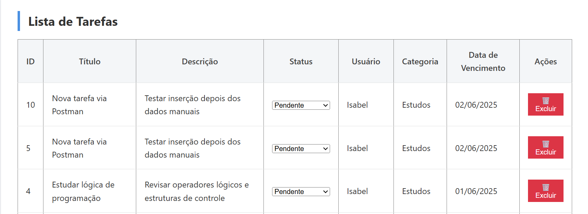
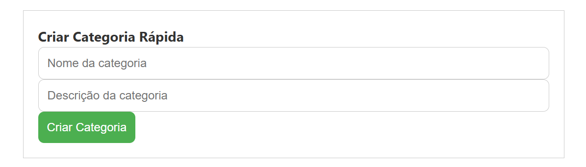
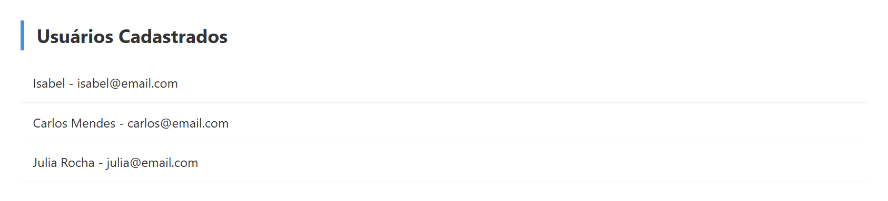
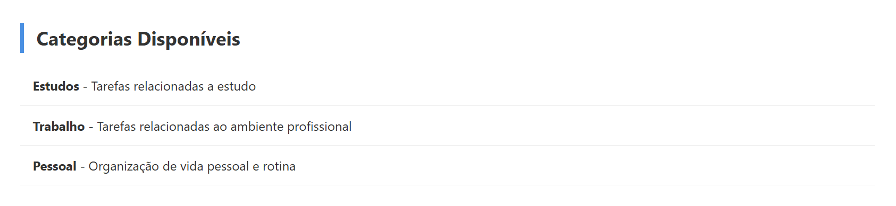

# Web Application Document - Projeto Individual - Módulo 2 - Inteli

## Taskly

#### Isabel Montenegro

## Sumário

1. [Introdução](#c1)  
<br>


2. [Projeto da Aplicação Web](#c2)  

<details>
  <summary>Subtópicos</summary>

- [2.1. Modelagem do banco de dados](#c2.1)
  - [2.1.1. BD e Models](#c2.1.1)
- [2.2. Arquitetura](#c2.2)
- [2.3. WebAPI e endpoints ](#c2.3)
- [2.4. Interface e Navegação](#c2.4)

</details>
<br>

3. [Desenvolvimento da Aplicação Web](#c3)  

<details>
  <summary>Subtópicos</summary>

- [3.1. Demonstração do Sistema Web](#c3.1)
- [3.2. Conclusões e Trabalhos Futuros](#c3.2)

</details>
<br>

4. [Referências](#c4)  


## <a name="c1"></a>1. Introdução 

O sistema desenvolvido é o **Taskly**, que permite o cadastro, listagem, edição e exclusão de tarefas por meio de uma interface web. Ele organiza as tarefas por categorias e disponibiliza uma visão geral de todas as tarefas registradas no sistema, funcionando como um painel de controle centralizado, voltado para o gerenciamento geral de atividades.

A aplicação segue a arquitetura MVC (Model-View-Controller), separando claramente a lógica de negócios, a manipulação dos dados e a apresentação das informações ao usuário. As views são renderizadas com a engine EJS, enquanto o servidor é construído com Node.js e Express.js, o que facilita a criação de rotas e a manipulação das requisições HTTP. O banco de dados utilizado é o MySQL, responsável pelo armazenamento das informações de usuários, tarefas e categorias.

O sistema possui funcionalidades para o gerenciamento completo de tarefas e usuários por meio de rotas específicas. Também estão implementados controladores para tratamento de erros e organização das operações de CRUD (Create, Read, Update, Delete). As tarefas podem ser acessadas diretamente via rotas RESTful, e os dados trafegam entre cliente e servidor em formato JSON.

A Fetch API pode ser utilizada para tornar a comunicação entre frontend e backend mais dinâmica, permitindo atualizações e envios de dados sem recarregar a página. Essa integração possibilita a construção de uma experiência mais fluida, embora seu uso ainda dependa de implementação nas views.


## <a name="c2"></a>2. Projeto da Aplicação Web

### 2.1. Modelagem do banco de dados  

O banco de dados foi projetado para armazenar as informações de **usuários**, **tarefas** e **categorias**, com relacionamentos bem definidos para garantir a integridade dos dados. O modelo inclui três tabelas principais:

* **Users**: Armazena informações dos usuários, como nome, email e senha.
* **Tasks**: Registra as tarefas criadas, com detalhes como título, descrição e data de entrega.
* **Categories**: Define as categorias que podem ser associadas às tarefas, facilitando a organização.

O modelo relacional é ilustrado no diagrama abaixo:

<div align="center">
<sub>Figura 01 - Modelo físico</sub>

<sup>Fonte: Material produzido pela autora (2025)</sup>
</div>
<br>

Além do diagrama, o modelo físico do banco de dados é definido no arquivo `init.sql`, que contém as instruções para criação e estruturação das tabelas:


```sql
CREATE TABLE Categories (
id INT AUTO\_INCREMENT PRIMARY KEY,
name VARCHAR(100) NOT NULL,
description TEXT,
created\_at TIMESTAMP DEFAULT CURRENT\_TIMESTAMP
);

-- Cria o banco de dados, se não existir
CREATE DATABASE IF NOT EXISTS gerenciador_tarefas;

-- Usa o banco de dados criado
USE gerenciador_tarefas;

-- Cria a tabela de usuários
CREATE TABLE Users (
    id INT AUTO_INCREMENT PRIMARY KEY,
    name VARCHAR(100) NOT NULL,
    email VARCHAR(100) NOT NULL UNIQUE,
    password VARCHAR(255) NOT NULL,
    created_at TIMESTAMP DEFAULT CURRENT_TIMESTAMP
);

-- Cria a tabela de tarefas
CREATE TABLE Tasks (
    id INT AUTO_INCREMENT PRIMARY KEY,
    user_id INT NOT NULL,
    category_id INT,
    title VARCHAR(255) NOT NULL,
    description TEXT,
    status ENUM('pendente', 'concluída', 'em progresso') DEFAULT 'pendente',
    due_date DATE,
    created_at TIMESTAMP DEFAULT CURRENT_TIMESTAMP,
    FOREIGN KEY (user_id) REFERENCES Users(id),
    FOREIGN KEY (category_id) REFERENCES Categories(id)
);
```


### 2.1.1 BD e Models 

O sistema Taskly utiliza um banco de dados PostgreSQL estruturado para representar a lógica de tarefas, usuários e categorias. Os models são definidos diretamente nos controladores com consultas SQL utilizando a biblioteca pg, mas seguem claramente a arquitetura MVC e representam as entidades do domínio da aplicação. Isso pode ser visualizado na imagem abaixo:

<div align="center">
<sub>Figura 02 - Arquitetura MVC</sub>

<sup>Fonte: Material produzido pela autora (2025)</sup>
</div>
<br>

**🔸 Model: Users**<br>
Responsável por armazenar os dados dos usuários do sistema.

Campos:
- *id:* identificador único (chave primária)
- *name:* nome do usuário
- *email:* email do usuário (único)
- *password:* senha criptografada (em produção)
- *created_at:* data de criação

**🔸 Model: Categories**<br>
Representa as categorias de tarefas.

Campos:

- *id:* identificador da categoria
- *name:* nome da categoria
- *description:* descrição opcional
- *created_at:* data de criação

**🔸 Model: Tasks**<br>
Model principal da aplicação, responsável por armazenar as tarefas cadastradas pelos usuários.

Campos:

- *id:* identificador da tarefa
- *user_id:* referência ao usuário (chave estrangeira)
- *category_id:* referência à categoria (chave estrangeira)
- *title:* título da tarefa
- *description:* descrição detalhada
- *status:* estado atual da tarefa (pendente, concluída, em progresso) usando tipo ENUM
- *due_date:* data limite para conclusão
- *created_at:* data de criação da tarefa

Todos os relacionamentos são definidos com chaves estrangeiras, e o status das tarefas é controlado por um tipo ENUM chamado task_status, garantindo integridade e padronização.

### 2.2. Arquitetura

Esta seção descreve a arquitetura MVC do projeto Taskly, detalhando o fluxo de dados e as responsabilidades de cada componente – do cliente ao banco de dados e vice-versa – para o gerenciamento de tarefas.

**1. Cliente/Postman:** O cliente (seja um navegador ou o Postman durante o desenvolvimento) inicia o processo enviando uma requisição HTTP. Essa requisição pode ser para criar uma nova tarefa (POST), obter uma lista de tarefas (GET), atualizar uma tarefa existente (PUT) ou deletar uma tarefa (DELETE).

**2. Rotas Express:** As rotas Express recebem a requisição e a direcionam para o Controller apropriado. Por exemplo, uma requisição para /api/tasks pode ser roteada para o TaskController.

**3. Controller (TaskController):** O Controller recebe a requisição das rotas. Ele processa a lógica de negócio necessária:

- Se for uma requisição para obter dados (GET), o Controller solicita os dados do Model.
- Se for uma requisição para criar, atualizar ou deletar dados (POST, PUT, DELETE), o Controller interage com o Model para realizar essas operações no banco de dados.

**4. Model (implícito no TaskController):** No seu projeto Taskly, a lógica do Model está implementada diretamente no TaskController.js. O Controller usa pool.query() para interagir com o banco de dados PostgreSQL, realizando as operações CRUD (Create, Read, Update, Delete) nas tabelas (por exemplo, tasks, users).

**5. Banco de Dados PostgreSQL:** O banco de dados armazena os dados do seu projeto. O Model (através do Controller) envia consultas SQL para o banco de dados e recebe os resultados (dados solicitados ou confirmação das operações).

**6. Controller (retorno):** O Controller recebe os dados do banco de dados (através do Model). Ele pode formatar esses dados, se necessário.

**7. Rotas Express (retorno):** As rotas Express recebem os dados do Controller e os enviam de volta ao cliente em um formato adequado (geralmente JSON).

**8. Cliente/Postman (recebimento):** O cliente recebe a resposta e a exibe ao usuário (no caso de uma interface web) ou a utiliza para testes (no caso do Postman).

Em resumo, o fluxo é: Cliente -> Rotas -> Controller -> Model (banco de dados) -> Controller -> Rotas -> Cliente. O Controller atua como intermediário, coordenando a interação entre a View (representada pelo Cliente) e o Model (a lógica de acesso aos dados, que no seu caso está dentro do Controller).

### 2.3. WebAPI e endpoints 

Esta seção apresenta a documentação da Web API desenvolvida para o sistema Taskly. A API segue o padrão REST e permite a interação com os dados de tarefas, usuários e categorias por meio de requisições HTTP. Abaixo estão listados os principais endpoints, seus métodos, estruturas esperadas e possíveis respostas.

Base URL:
```sql
http://localhost:8080
http://localhost:8080/manage
http://localhost:8080/api
```

**🔸 1. Criar Tarefa**

- Método: POST
- Endpoint: /tasks
- Descrição: Cria uma nova tarefa vinculada a um usuário e uma categoria.
- Body (JSON):

```sql
{
  "user_id": 1,
  "category_id": 1,
  "title": "Estudar lógica de programação",
  "description": "Revisar operadores lógicos",
  "status": "pendente",
  "due_date": "2025-06-01"
}
```

- Respostas:

  - 201 Created: tarefa criada com sucesso
  - 400 Bad Request: Campos obrigatórios ausentes ou inválidos.
  - 500 Internal Server Error: erro ao inserir tarefa

**🔸 2. Listar Todas as Tarefas**

- Método: GET
- Endpoint: /tasks
- Descrição: Retorna todas as tarefas cadastradas, com seus respectivos usuários e categorias.
- Respostas:
  - 200 OK: Lista de tarefas retornada.
  - 500 Internal Server Error: Erro ao buscar as tarefas.

**🔸 3. Buscar Tarefa por ID**

- Método: GET
- Endpoint: /tasks/:id
- Descrição: Retorna os detalhes de uma tarefa específica, informada pelo seu id.
- Parâmetros de rota:
  - id (number): ID da tarefa.
- Respostas:
  - 200 OK: Tarefa encontrada.
  - 404 Not Found: Tarefa não encontrada.
  - 500 Internal Server Error: Erro interno.


**🔸 4. Atualizar Tarefa**

- Método: PUT
- Endpoint: /tasks/:id
- Descrição: Atualiza uma tarefa existente.
- Body (JSON):

```sql
{
  "user_id": 1,
  "category_id": 1,
  "title": "Estudar JavaScript",
  "description": "Curso completo de JS",
  "status": "em progresso",
  "due_date": "2025-06-02"
}
```

- Respostas:
  - 200 OK: tarefa atualizada
  - 400 Bad Request: Dados inválidos.
  - 404 Not Found: Tarefa não encontrada.
  - 500 Internal Server Error: Erro ao atualizar a tarefa.

**🔸 5. Excluir Tarefa**

- Método: DELETE
- Endpoint: /tasks/:id
- Descrição: Remove uma tarefa pelo ID.
- Parâmetros de rota:
  - id (number): ID da tarefa.
- Resposta:
  - 200 OK: Tarefa removida.
  - 404 Not Found: Tarefa não encontrada.
  - 500 Internal Server Error: Erro ao excluir.

**🔸 6. Listar Tarefas por Usuário**

- Método: GET
- Endpoint: /users/:user_id/tasks
- Descrição: Retorna todas as tarefas vinculadas a um usuário específico.
- Parâmetros de rota:
  - user_id (number): ID do usuário.
- Respostas:
  - 200 OK: Lista retornada.
  - 404 Not Found: Nenhuma tarefa encontrada para o usuário.
  - 500 Internal Server Error: Erro ao buscar as tarefas.


**🔸 7. Listar Tarefas por Categoria**

- Método: GET
- Endpoint: /categories/:category_id/tasks
- Descrição: Retorna todas as tarefas pertencentes a uma categoria específica.
- Parâmetros de rota:
  - category_id (number): ID da categoria.
- Respostas:
  - 200 OK: Lista retornada.
  - 404 Not Found: Nenhuma tarefa encontrada para a categoria.
  - 500 Internal Server Error: Erro ao buscar as tarefas.

### 2.4 Interface e Navegação 

O sistema conta com uma interface web desenvolvida com HTML, EJS e CSS, seguindo a arquitetura MVC. As páginas são renderizadas dinamicamente com dados reais vindos do banco de dados, por meio de templates .ejs. O foco foi criar uma navegação clara, intuitiva e funcional, especialmente para o gerenciamento de tarefas por usuários.

#### 📂 Estrutura de navegação
O frontend apresenta as seguintes páginas principais:

- **Página inicial (/):** exibe uma lista de todas as tarefas cadastradas no sistema, com título, status, data de entrega, nome do usuário e categoria associada. Essa visão é mais útil para um perfil de administrador.


<div align="center">
<sub>Figura 02 - Pagina Inicial </sub>

<sup>Fonte: Material produzido pela autora (2025)</sup>
</div>
<br>

Mostra a tabela com tarefas renderizadas com EJS, incluindo colunas como "Título", "Descrição", "Status", "Data de entrega", "Usuário", "Categoria" e botões de "Editar" e "Excluir".

- **Página de criar tarefas (/tasks/create):** essa página contém um formulário completo, com campos para título, descrição, status, data de entrega, além de seletores para escolher o usuário e a categoria.


<div align="center">
<sub>Figura 03 - Criar nova tarefa </sub>

<sup>Fonte: Material produzido pela autora (2025)</sup>
</div>
<br>


- **Página de criação de categorias (/tasks/edit/:id):** inclui um formulário de criação rápida, permitindo adicionar novas categorias com nome e descrição diretamente da interface. Essa funcionalidade simplifica a gestão de categorias vinculadas às tarefas.

👉 [Inserir print da tela de edição de tarefa]
<div align="center">
<sub>Figura 04 - Criar categoria </sub>

<sup>Fonte: Material produzido pela autora (2025)</sup>
</div>
<br>

- **Página de usuários (/users):** lista todos os usuários cadastrados e permite navegar até a lista de tarefas de cada um.

<div align="center">
<sub>Figura 05 - Usuários cadastrados </sub>

<sup>Fonte: Material produzido pela autora (2025)</sup>
</div>
<br>

- **Página de categorias (/categories):** mostra todas as categorias registradas e suas respectivas tarefas.

<div align="center">
<sub>Figura 06 - Categorias disponíveis </sub>

<sup>Fonte: Material produzido pela autora (2025)</sup>
</div>
<br>

#### 🎨 Estilização
O layout do sistema utiliza CSS personalizado, com foco em clareza, organização visual e responsividade básica. Estilos foram aplicados principalmente em:

- Tabelas de dados (listas de tarefas, usuários e categorias).
- Formulários de criação e edição.
- Botões de ação (criar, editar, excluir).


#### 🔗 Integração com Backend
A navegação é integrada com o backend via rotas definidas em arquivos .ejs e, em alguns casos, com fetch API para requisições assíncronas (ex: exclusão de tarefas via JavaScript sem recarregar a página).


```sql
document.querySelectorAll('.delete-button').forEach(button => {
  button.addEventListener('click', () => {
    const taskId = button.getAttribute('data-id');

    fetch(`/tasks/${taskId}`, {
      method: 'DELETE'
    })
    .then(response => {
      if (response.ok) {
        location.reload();
      } else {
        alert('Erro ao excluir tarefa.');
      }
    });
  });
});
```

Trecho de JavaScript dentro de script que utiliza fetch('/tasks/:id', { method: 'DELETE' }) para remover tarefas dinamicamente.


## <a name="c3"></a>3. Desenvolvimento da Aplicação Web (Semana 8)

### 3.1 Demonstração do Sistema Web (Semana 8)

*VIDEO: Insira o link do vídeo demonstrativo nesta seção*
*Descreva e ilustre aqui o desenvolvimento do sistema web completo, explicando brevemente o que foi entregue em termos de código e sistema. Utilize prints de tela para ilustrar.*

### 3.2 Conclusões e Trabalhos Futuros (Semana 8)

*Indique pontos fortes e pontos a melhorar de maneira geral.*
*Relacione também quaisquer outras ideias que você tenha para melhorias futuras.*


## <a name="c4"></a>4. Referências

_Incluir as principais referências de seu projeto, para que o leitor possa consultar caso ele se interessar em aprofundar._<br>
